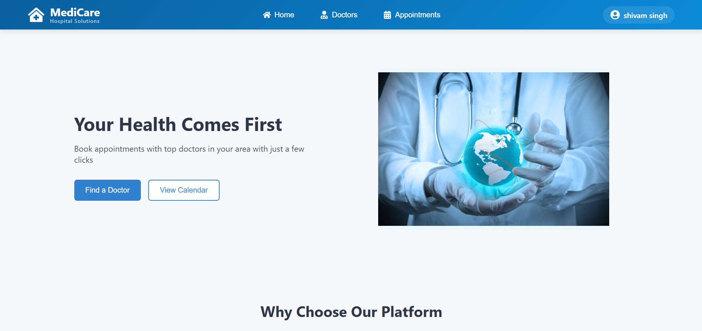

# 🏥 Doctor Appointment Booking System

A modern, responsive web application for booking doctor appointments with calendar integration. Built with React, this system helps patients find doctors and schedule visits, while giving doctors an organized view of their appointments.

() 

## ✨ Features

### For Patients
- 📅 Interactive calendar view to browse available slots
- 🔍 Search and filter doctors by specialty
- ⚡ Quick booking with confirmation
- ✏️ Edit or cancel appointments

### For Doctors
- 🗓️ Clean schedule overview
- 👥 Patient management
- 🔔 Appointment notifications

### Technical Highlights
- 🚀 Built with React 
- 🎨 Styled with Normal CSS
- 📱 Fully responsive design
- 🔄 State management with Context API

## 🛠️ Installation

1. **Clone the repository**
   ```bash
   git clone https://github.com/ShivamSingh0111/Medicare.git
   cd Medicare


### Project Structure
```
doctor-appointment-system/
├── components/          
├── context/           
├── pages/             
├── public/              
├── styles/             
├── utils/               
└── README.md            
```

###🌟 Why This Project?

This isn't just another appointment system - it's designed with real healthcare needs in mind:

Patient-first UX: Simple booking process that anyone can use
Doctor-friendly: Clean interface that saves time
Modern tech stack: Built with the latest web technologies
Customizable: Easy to adapt for different medical practices
